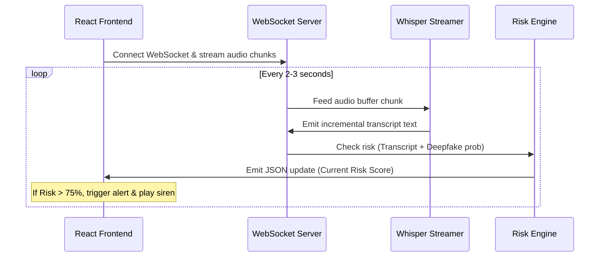

# Team Collaboration Plan: Milestones 4 & 5
This document coordinates the parallel development of **Milestone 4 (Real-Time Live Streaming & Scam Mitigation)** and **Milestone 5 (Conversational Advisory Chatbot & Analytics Center)** for a 3-developer team using Antigravity and Git.

---

## 1. Developer Roles & System Boundaries
To avoid code overlap and merge conflicts, developers own specific directory structures and architectural boundaries.

```
AI-Scam-Detection/
├── backend/
│   └── app/
│       ├── api/          <--- Developer 1 (Endpoints, WebSockets routing)
│       ├── database/     <--- Developer 2 (SQL models, CRUD, reporting)
│       ├── services/     <--- Developer 2 (Streaming Whisper, audio buffer queue)
│       └── rag/          <--- Developer 3 (Chatbot engine, real-time prompt audits)
└── frontend/             <--- Developer 1 (Live streaming UI, charts, chatbot chatbox)
```

| Developer | Domain | Key Directory/Files | Focus Area |
| :--- | :--- | :--- | :--- |
| **Developer 1** | Frontend & WebSockets | `frontend/`, `backend/app/api/` | WebSocket clients, Live waveform, Threat warnings, Analytics UI, RAG Chat interface. |
| **Developer 2** | Audio Buffers & Databases | `backend/app/services/`, `backend/app/database/` | Binary WebSocket chunking, Whisper queue, Reporting database models, Analytics query APIs. |
| **Developer 3** | RAG Chat & Risk Optimization | `backend/app/rag/`, `knowledge_base/` | Conversational RAG, Chat memory management, Low-latency prompt evaluation. |

---

## 2. Milestone 4: Real-time Live-Streaming & Threat Mitigation
**Goal**: Stream microphone audio chunks over WebSockets in real-time -> Backend transcribes on-the-fly -> Risk engine checks incoming text dynamically -> If risk exceeds `75%`, instantly trigger a visual/audio threat overlay in the browser.



### Developer 1: Live Streaming Client & Visualizer
* **Branch**: `feature/m4-streaming-client`
* **Tasks**:
  * Set up a Web Audio API recorder inside React that captures audio in raw PCM or WebM chunks and streams them via WebSocket to `/api/v1/analyze/stream`.
  * Add a live voice waveform visualizer using the HTML Canvas API.
  * Implement a full-screen critical threat warning overlay with a siren alert sound and a simulated **"Force Hang Up"** button when the server emits a risk score > `0.75`.
  * Add quick-links to file official cyber fraud reports on the National Cyber Crime Portal ([cybercrime.gov.in](https://cybercrime.gov.in)).
* **Antigravity Prompt**:
  > "Using React and the Web Audio API, implement a WebSocket client in Dashboard.jsx that streams mic audio chunks to `/api/v1/analyze/stream`. Create a visual waveform canvas. Create a threat warning overlay that triggers immediately when the server returns a risk score above 75%, complete with an emergency alert layout and a button link to cybercrime.gov.in."

### Developer 2: WebSocket Server & Streaming STT Queue
* **Branch**: `feature/m4-streaming-server`
* **Tasks**:
  * Implement a FastAPI WebSocket router endpoint `ws://127.0.0.1:8000/api/v1/analyze/stream`.
  * Build an asynchronous audio chunk accumulator queue that passes chunks to `WhisperService` dynamically.
  * Extend `whisper_service.py` to support streaming transcription models or run fast segment-based transcribing.
  * Broadcast incremental analysis updates back to the WebSocket client, concluding by saving the aggregated call logs to SQLite on disconnect.
* **Antigravity Prompt**:
  > "Create a FastAPI WebSocket endpoint under `api/analyze.py` to accept binary audio packets. Accumulate them in a buffer queue, run Whisper on new segments asynchronously, and send back real-time transcript updates and scam risk indicators. Save the final compiled conversation log into the database when the connection closes."

### Developer 3: Low-Latency Prompts & Real-time Risk Engine
* **Branch**: `feature/m4-streaming-prompts`
* **Tasks**:
  * Optimize the RAG prompt evaluation to operate in "incremental mode" (evaluating early warnings on first sentences).
  * Design a fast-path regex/semantic scan that flags critical keywords immediately without waiting for expensive LLM runs.
  * Adjust `RiskEngine.calculate_combined_risk` to safely update risk dynamically as more transcript data arrives.
* **Antigravity Prompt**:
  > "Optimize `backend/app/services/analyzer.py` and `risk_engine.py` for real-time streaming updates. Add a low-latency regex/semantic scanner to trigger alerts on immediate threat keywords (e.g. 'cbi arrest', 'otp validation') before running full LLM evaluation. Ensure risk scores are updated incrementally without blocking WebSocket responses."

---

## 3. Milestone 5: Conversational Advisory Chatbot & Analytics Center
**Goal**: Create a dedicated safety center allowing users to query RBI / CERT-In regulations directly using a RAG-backed chatbot, and visualize global threat trends via an analytics panel.

### Developer 1: Chatbot Interface & Analytics Charts
* **Branch**: `feature/m5-analytics-ui`
* **Tasks**:
  * Build a multi-tab panel in the React app: **Live Scanner**, **Scam Guard Agent (Chatbot)**, and **Analytics Center**.
  * Construct a clean, modern chat feed for the Scam Guard Agent (RAG bot).
  * Build customized visual metrics charts (using a lightweight charting library or premium CSS grid bar charts) displaying scam category distributions, average deepfake probability, and threat history over time.
* **Antigravity Prompt**:
  > "Add navigation tabs to the React frontend. Implement a conversational RAG chatbot tab with a polished chatbox layout. Build a visual analytics dashboard using styled CSS elements to display graphs of scam categories, historical risk trends, and metrics retrieved from the backend."

### Developer 2: Reporting Database & Analytics APIs
* **Branch**: `feature/m5-analytics-db`
* **Tasks**:
  * Create a new database table and SQLAlchemy model `SpamReport` to hold community-reported numbers: `id`, `phone_number`, `scam_category`, `reports_count`, `last_reported`.
  * Expose API endpoints `POST /api/v1/spam/report` and `GET /api/v1/spam/lookup/{number}`.
  * Implement `GET /api/v1/analytics` endpoint returning aggregated JSON metrics from both `CallLog` and `SpamReport` (e.g., categories counts, monthly risk averages).
* **Antigravity Prompt**:
  > "Define a new `SpamReport` SQLAlchemy model in `database/models.py` to store reported scam numbers. Create CRUD methods in `database/crud.py` to save, fetch, and increment reports. Implement `/api/v1/analytics` and `/api/v1/spam` routers to expose stats and telephone lookup APIs."

### Developer 3: Conversational RAG Engine & History Memory
* **Branch**: `feature/m5-rag-chat`
* **Tasks**:
  * Build `backend/app/rag/chat_engine.py` using ChromaDB and a Conversational retrieval chain.
  * Implement query handlers that inject custom conversation history (memory buffer) along with matched RBI rules to answer follow-up queries.
  * Format the conversational output with Markdown recommendations, highlighting legal rights, grievance redressal options, and steps to recover lost funds.
* **Antigravity Prompt**:
  > "Create `chat_engine.py` in `backend/app/rag/` to implement a conversational RAG assistant. Query the ChromaDB advisory vectors using user queries, format answers using RBI/CERT-In rules as context, and include conversational memory to support follow-up questions."

---

## 4. Git Integration Protocol
To ensure smooth integration:
1. **Synchronize Branches**: Keep feature branches up-to-date with `main` via:
   ```bash
   git checkout main
   git pull origin main
   git checkout feature/your-branch
   git merge main
   ```
2. **Integration Checks**: Verify that REST and WebSocket routes do not block port allocation and fallback to mock interfaces gracefully if external database services (like ChromaDB or local GPU drivers) are loading.
